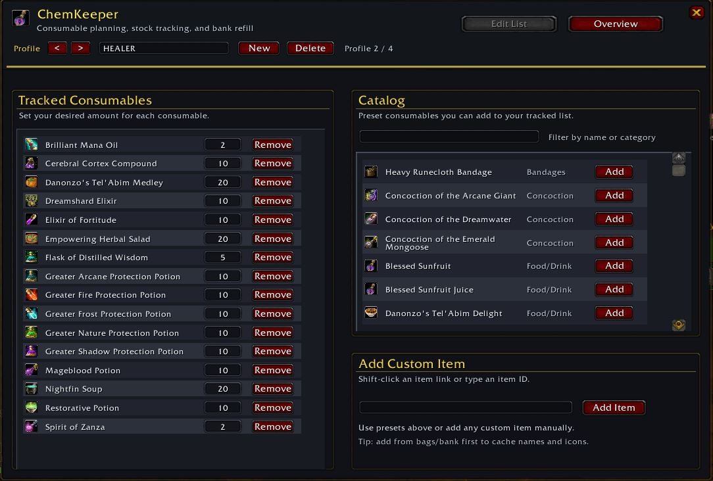
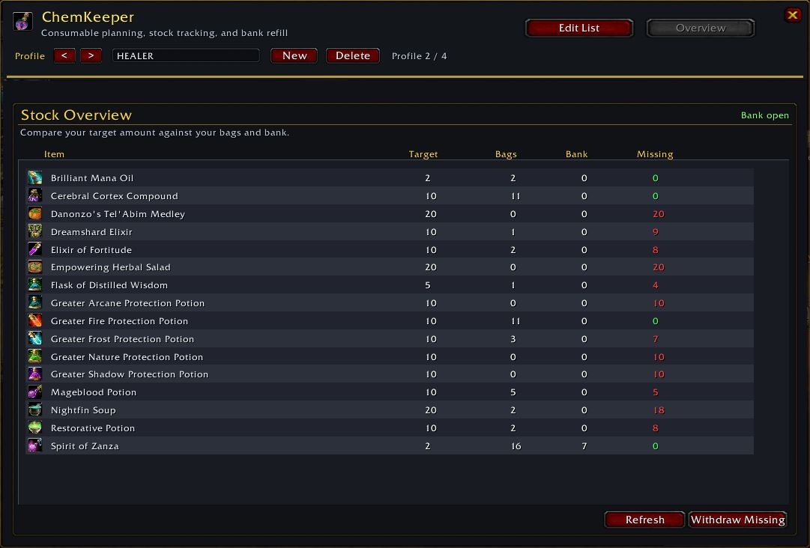

# ChemKeeper

Raid consumable planning, stock tracking, and safe bank refill for Turtle WoW / Vanilla 1.12.

Developed for guild **BELUGA** - Nordanaar  
Author: **Eggorkus**

---

## English

### What It Is

ChemKeeper helps you prepare for raids by tracking the consumables you want to keep on hand for each profile.

You can build custom lists, use preset role profiles, compare `Target / Bags / Bank / Missing`, and safely pull missing items from the bank.

### Screenshots

**Edit List**

**Overview**

### Highlights

- Draggable minimap button
- `Edit List` tab with tracked consumables and target quantities
- Built-in consumable catalog based on the current RABuffs item list
- Custom item input by item link or item ID
- `Overview` tab with `Target`, `Bags`, `Bank`, and `Missing`
- `Withdraw Missing` button for safe bank withdrawal
- Profile system with create, rename, delete, and per-profile tracking

### Preset Profiles

Available now:
- `HEALER`
- `PHYSTANK`
- `SPDTANK`

Planned:
- `DPS` - TBD
- `SPDDPS` - TBD

### Quick Use

1. Pick a preset profile or create your own.
2. Add consumables from the catalog or through `Add Custom Item`.
3. Set the desired target amount for each tracked item.
4. Open your bank.
5. Switch to `Overview`.
6. Press `Withdraw Missing`.

### Notes

- ChemKeeper avoids unsafe stack-swapping behavior while moving items from the bank.
- Charge-based items such as weapon oils are counted as items, not raw charges.
- If you do not have enough free bag space, ChemKeeper will warn you in chat.

---

## Русский

### Что Это Такое

ChemKeeper помогает готовиться к рейдам: аддон отслеживает нужные расходники для каждого профиля и показывает, чего не хватает прямо сейчас.

Можно собирать свои списки химии, использовать готовые пресет-профили, сравнивать `Target / Bags / Bank / Missing` и безопасно добирать недостающее из банка.

### Скриншоты

**Edit List**

**Overview**

### Основные Возможности

- Перетаскиваемая кнопка у миникарты
- Вкладка `Edit List` со списком отслеживаемых расходников
- Встроенный каталог расходников на основе актуального списка из RABuffs
- Добавление кастомного предмета по item link или item ID
- Вкладка `Overview` с колонками `Target`, `Bags`, `Bank`, `Missing`
- Кнопка `Withdraw Missing` для безопасного добора из банка
- Система профилей: создание, переименование, удаление и отдельный трекинг для каждого профиля

### Пресет-Профили

Уже доступны:
- `HEALER`
- `PHYSTANK`
- `SPDTANK`

Запланированы:
- `DPS` - TBD
- `SPDDPS` - TBD

### Как Пользоваться

1. Выбери готовый профиль или создай свой.
2. Добавь расходники из каталога или через `Add Custom Item`.
3. Укажи нужное количество для каждого предмета.
4. Открой банк.
5. Переключись на вкладку `Overview`.
6. Нажми `Withdraw Missing`.

### Примечания

- ChemKeeper специально избегает небезопасного поведения со swap/stack при переносе предметов из банка.
- Предметы с зарядами, например weapon oils, учитываются как отдельные предметы, а не как сумма зарядов.
- Если в сумках не хватает свободного места, аддон сообщит об этом в чат.
